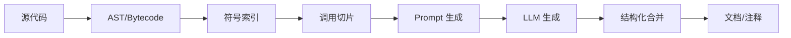

项目地址：[GJavaDoc](https://github.com/GeekyWizKid/GJavaDoc)。

一句话：把难啃的遗留代码，通过“静态分析 + LLM 生成”的方式，持续产出可读文档。

<!--more-->

## 一、思路

1) 先做“能确定的部分”：注解扫描、AST/字节码解析、切片（谁调用谁）。
2) 再让模型补“难推断的部分”：业务意图、边界条件、异常语义。
3) 增量化：只处理变更的文件/符号；
4) 并发化：Kotlin 协程流水线，CPU 与 I/O 混排；

## 二、管线结构



## 三、关键实现

### 1. 增量与缓存

```kotlin
data class Fingerprint(val path: String, val sha: String)

fun dirtyFiles(repo: Path): List<Path> =
  gitChangedFiles(repo).filter { f ->
    val sha = sha256(repo.resolve(f))
    cache[f] != sha
  }
```

### 2. 协程并发

```kotlin
suspend fun <T> parallel(inputs: List<T>, n: Int, block: suspend (T) -> Unit) =
  coroutineScope {
    val sem = Semaphore(n)
    inputs.map { x ->
      launch {
        sem.withPermit { block(x) }
      }
    }.joinAll()
  }
```

### 3. Prompt 结构

用“约束 + 证据”的方式减少幻觉：

```json
{
  "function": "UserService.resetPassword",
  "calls": ["TokenService.verify", "MailService.send"],
  "exceptions": ["TokenExpiredException"],
  "code": "...片段...",
  "ask": "以要点说明：输入前置条件/副作用/失败分支/并发注意/返回值" 
}
```

LLM 只补充“解释”，不改动事实。

## 四、文档合并

输出分两层：

- 源码注释（KDoc/Javadoc）：贴近使用者；
- 站点文档（MkDocs/Hugo）：全局导航、示例、FAQ。

## 五、风险与对策

- 幻觉：必须带“调用切片和异常列表”，给模型约束；
- 大文件：分段 + 交叉摘要；
- 私有代码：本地模型或企业代理通道；

## 六、结语

“先静态分析，再请模型讲人话”，是我实践里最稳的路线。
