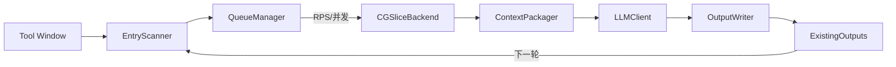

项目地址：[GJavaDoc](https://github.com/GeekyWizKid/GJavaDoc)

本文基于源码逐行阅读的结果，对 GJavaDoc 的设计与实现做一份“工程级”的深度解析：为什么这样设计、关键权衡是什么、哪里容易踩坑，以及如何把它用在你自己的遗留项目里。

核心策略一句话概括——“事实交给程序，表达交给模型”。把能确定的事实（入口、签名、相关类型、代码片段、模块归属、历史产物）用静态分析和 PSI 拿稳，再让 LLM 按强约束的提示把事实“讲清楚”。这样文档才稳定、可复现、可增量、可并发生成。

<!--more-->

## 1. 总体架构（IDE 内的流水线）



- 插件骨架：Tool Window + 后台任务，配置使用 IntelliJ 的 `PersistentStateComponent` 保存（`src/main/kotlin/com/gjavadoc/settings/SettingsState.kt:1`）。
- 任务调度：`QueueManager` 用“RPS 限速 + 信号量并发 + 有界队列 + 重试 + 心跳”的组合保证流畅与可控（`src/main/kotlin/com/gjavadoc/queue/QueueManager.kt:1`）。
- 增量：`ExistingOutputs` 只认 `docs/`，以“文件名去时间戳”的方式判重（`src/main/kotlin/com/gjavadoc/io/ExistingOutputs.kt:1`）。

## 2. 入口识别：注解扫描的正确打开方式

- 位置：`src/main/kotlin/com/gjavadoc/scan/EntryScanner.kt:1`
- 机制：从 Settings 读取注解列表（支持逗号/空白分隔，自动去掉前导 @），在 `GlobalSearchScope` 内遍历 Java 文件→类→方法，命中类注解或方法注解即视为入口。
- 细节：
  - 用 `PsiDocumentManager` 计算行号，后续用于“锚点切片”和“上下文展示”。
  - 支持限制到某个 Module 的搜索范围，与工具窗的模块选择联动。

示例返回的数据结构（`EntryPoint`）包含：`classFqn / method(签名) / file / line / annotation`。

## 3. 调用图与切片：WALA 反射接入，锚点式证据

- 位置：`src/main/kotlin/com/gjavadoc/analysis/WalaCGSliceBackend.kt:1`
- 设计要点：
  - 通过 `ModuleManager + CompilerModuleExtension + ModuleRootManager` 收集 classpath（含编译输出与三方库）。
  - 用“反射”调用 WALA API（兼容包名迁移），避免插件对 WALA 有编译期硬依赖，缺 Jar 时能优雅降级。
  - 构建 0-CFA 调用图，给出图规模摘要（nodes 数）。
  - 返回 `CGSliceResult{ summary, anchors[] }`，anchors 用“文件路径 + 起止行号”定位证据。当前先锚到入口附近，后续可接入真正的 WALA Slicer。
- 失败时：捕获异常并输出 `[wala-error]` 摘要 + 保底锚点，保证流水线不中断。

> 这种“摘要 + 锚点”的轻切片策略有两个好处：
> - 始终可用（缺 JAR、版本差异都能降级）。
> - 与 `ContextPackager` 的行号拼接天然匹配。

## 4. 上下文打包：只给模型需要看的

- 位置：`src/main/kotlin/com/gjavadoc/context/ContextPackager.kt:1`
- 打包内容：
  1) Entry 方法源码（带行号）；
  2) 调用图摘要；
  3) anchors 对应的多段源码；
  4) 相关类型（DTO/VO/Entity/Enum）：`typeSuffixes / packageKeywords / annotationWhitelist` 三套规则筛选，按 `typeDepth` 展开；
  5) 被调方法清单（可开关，`collectCalled / calledDepth`）。
- 产出：长文本写入 `context-bundles/<taskId>.txt`，并返回 `ContextBundle{text, path}` 供后续使用。
- 截断：超出 `maxChars` 直接裁剪并标注 `... [truncated]`，防止把 LLM 堵死。

## 5. 提示与生成：OpenAI/Ollama 双栈兼容

- 位置：`src/main/kotlin/com/gjavadoc/llm/LLMClient.kt:1`
- 选择：`LLMClientFactory.create()` 依据 `useHttpClient` 决定 `HttpLLMClient` 还是 `StubLLMClient`。
- 兼容策略：
  - OpenAI 风格：POST `/v1/chat/completions`，附 `max_tokens/temperature/top_p`（不少后端需要显式参数）。
  - Ollama 风格：POST `/api/chat` 或 `:11434`，自动切换 body。
- 健壮性：
  - `extractContent()` 能从多种响应体中提取 `content`，并处理 `\uXXXX` 转义与 HTML 实体；
  - `stripThinkTags()` 移除 `<think>...</think>` 推理块，得到干净的 Markdown；
  - `unwrapMarkdownFence()` 解除围栏，直写 `.md` 更可读。
- 提示模板：`PromptBuilder` 的默认模板给足“表格规范 + 推断规则 + Java 代码粘贴区”；也支持完全自定义模板（`customPromptEnabled`）。

## 6. 输出与增量：文件名就是协议

- 写入：`OutputWriter` 将 Markdown 写至 `docs/`，可选把 JSON 写至 `method-docs/`；勾选“按模块分目录”后写到 `docs/<module>/...`（`QueueManager.moduleFolderFor()`）。
- 命名：
  - 方法级：`docs/com.pkg.Clz_method_Param1_Param2__<timestamp>.md`
  - 类级：`docs/com.pkg.Clz_CLASS__<timestamp>.md`
  - 统一用 `safe()` 过滤非法字符。
- 增量：`ExistingOutputs.index()` 只看 `docs/`，并在解析 stem 时去掉结尾的 `_数字` 时间戳，以“同类同签名”判重。

## 7. 调度与并发：RPS + 并发闸门 + 心跳

- 位置：`src/main/kotlin/com/gjavadoc/queue/QueueManager.kt:1`
- 关键点：
  - RPS：通过 `scheduleAtFixedRate` 按 `requestsPerSecond` 驱动 `tick()`；
  - 并发：`Semaphore` 作为硬闸门，`indicators.size` 作为“正在运行”指标；
  - 队列：`backlog` + 有界 `ArrayBlockingQueue`，避免瞬时洪峰；
  - 重试：`retry(maxAttempts/backoffMs)` 配置化；
  - 心跳：每 250ms 合并上报 `QueueStatus` 到 MessageBus，Tool Window 实时刷新；
  - 动态调参：`refreshLimiterIfChanged()` 运行期增减 permits，不需要重启队列。

这段核心逻辑很值得学习（伪代码）：

```kotlin
val capacity = settings.maxConcurrentRequests - indicators.size
while (dispatched < capacity) {
  val task = q.poll() ?: break
  if (!permits.tryAcquire()) { q.offer(task); break }
  executeTask(task)
  dispatched++
}
```

## 8. 易错点与对策（来自源码的“工程味”）

- PSI 索引：IDE 处于 Dumb Mode 时，必须在 `runReadActionInSmartMode` 读取 PSI（`GJavaDocService.kt:31`），否则抛 `IndexNotReadyException`。
- 产物命名：统一 `safe()`，并利用“去时间戳”的解析保证“可追溯 + 可判重”（`ExistingOutputs.kt:18`）。
- 模块归档：`ModuleUtilCore.findModuleForFile` 可能失败，需判空并兜底到根目录（`QueueManager.kt:188`）。
- WALA 版本差异：包名迁移与 API 变更通过反射适配，失败时降级为 stub summary（`WalaCGSliceBackend.kt:16`）。
- LLM 响应混杂：用 `stripThinkTags/cleanupHumanReadable` 二次清洗，避免把“推理过程”写进文档（`LLMClient.kt:152`）。

## 9. 操作手册（实战建议）

1) 打开项目，`./gradlew runIde` 以沙箱启动插件。
2) Settings → GJavaDoc：
   - Annotation：如 `@RpcService,@DubboService`；
   - LLM：本地 vLLM 或 OpenAI 兼容后端；`max_tokens/temperature/top_p` 默认已填；
   - 并发与速率：初次建议 `maxConcurrentRequests=2`、`requestsPerSecond=1.5`；
   - Context：`typeDepth=2`、`collectCalled=true`（数据量过大时可先关）。
3) 工具窗选择 Module 或 ALL，Run Scan；
4) 观察队列与运行；失败可 `Retry`，或 `Retry Timeouts`；
5) 产物查看：`docs/`（最终 Markdown）、`method-docs/`（原始 JSON，若启用）、`context-bundles/`（证据文本）。

## 10. 与替代方案的对比

- 只手写 Javadoc：准确但人力重、不可持续；
- 只靠 LLM“读仓库”：可复现性差，易幻觉；
- 只做静态分析：事实够硬，但“写好话”很难。

GJavaDoc 的平衡点：事实由 PSI/轻切片提供，表达交给 LLM，中间用提示规范与清洗把关；配合并发与增量，在 IDE 内形成“所见即得”的工程化流水线。

## 11. 路线图（作者注释 + 我的建议）

- 真切片：用 WALA Slicer/SDG 定位“入参来源/判空/异常路径”，让参数表更“有据可依”。
- 运行期证据模式：在测试用例里挂探针收集调用栈/SQL/HTTP，补足反射与动态代理场景。
- 多语言：继续完善 Kotlin/Scala 支持（协程/挂起、Actor 模式特征）。
- IDE 体验：编辑器内实时预览 + 一键回写到 Javadoc。

---

文档生成不是“让模型瞎编”，而是“让模型把事实讲清楚”。把“事实管道”做好，把“生成规范”定紧，才是把遗留代码“清理出”可用文档的正解。
