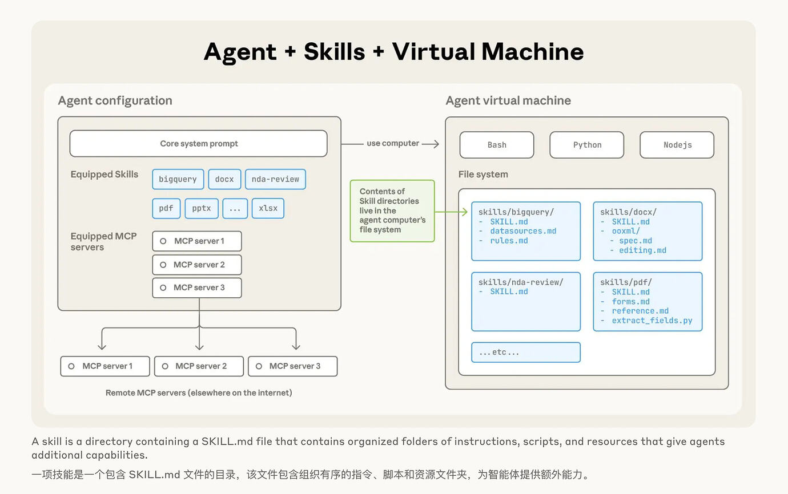

 近期 Claude 推出了 Skills ，关于 Skills 的使用，Claude 官方 blog中有提到一句
 > **How Skills work:** When Claude encounters a task, it scans available Skills to find relevant matches. Skills use progressive disclosure: metadata loads first (~100 tokens), providing just enough information for Claude to know when a Skill is relevant. Full instructions load when needed (<5k tokens), and bundled files or scripts load only as required.  
 
 翻译一下：
 >技能工作原理：当克劳德遇到任务时，它会扫描可用技能以寻找相关匹配项。技能采用渐进式披露机制：首先加载元数据（约 100 个词元），仅提供足够信息让克劳德判断技能是否适用；需要时加载完整指令（少于 5000 个词元）；捆绑的文件或脚本仅在需要时加载。
 
 这说法让人天然联想到 MCP ， MCP 也是提供调用契约（个人在开发语境中更喜欢用这个词），以供 LLM 调用。那么随着 Skills 的火热和 MCP 的退潮，他们之间具体存在什么关系？Skill 是否会替代 MCP ？

以下是个人见解，抛砖引玉：

首先回到官方 blog ， 官方是如何解释 Skills 的起源的

>Claude is powerful, but real work requires procedural knowledge and organizational context. Introducing Agent Skills, a new way to build specialized agents using files and folders.  

翻译一下：
>Claude 功能强大，但实际工作需要流程知识和组织背景。现推出智能体技能——通过文件和文件夹构建专业智能体的全新方式。

回到 MCP ：
>MCP is an open protocol that standardizes how applications provide context to LLMs.  
  Think of MCP like a USB-C port for AI applications. Just as USB-C provides a standardized way to connect your devices to various peripherals and accessories, MCP provides a standardized way to connect AI models to different data sources and tools.  

>MCP 是一种开放协议，旨在标准化应用程序向 LLMs 提供上下文的方式。
>可以将 MCP 想象成 AI 应用的 USB-C 接口。正如 USB-C 为设备连接各种外设和配件提供了标准化方式，MCP 也为 AI 模型连接不同数据源和工具提供了标准化方法。

从两者的官方描述来看，Skills 提供的是一种更高层次的(抽象层面)，指导性的，团队共识性质的技能。普遍体现在工作流程性质，而 MCP 则是组成了原子“操作”。用程序员更熟悉的类比来说， Skills 提供的是 service 层面的流程抽象， MCP 提供的是 Utils 或者 Connector 级别的能力。这从两者的官图可以看出

因此，我最早的想法 **Skils 是用来替换 MCP** 的推测不成立。
那么两者是怎样的协作关系？
经常使用大模型的小伙伴应该隐约有种感觉，使用 LLM 进行长流程运作就像玩**画背猜谜**，中间任意一个环节出现小偏差就会导致结果与预期南辕北辙。因此 Skills 应运而生，旨在用确定的框架、流程约束期望结果。
>这里要先提出一个观点，我认为运作良好的规范和框架是能有效收敛预期与结果的，虽然实际情况往往不尽如人意。可参见日常生活中组织架构和安全操作手册的运作。

从协作关系来看，这里存在几种隐含的关系：
1. Skills 编排 + MCP 连接
	把 SOP/风格规范/验收标准写入 SKILL.md（必要时再拆分成 reference.md、forms.md 等子文件），并在技能中附带少量脚本用于确定性步骤；当需要**触达外部系统**（CRM、CI、DB、SaaS）时，通过 MCP 调用那些工具
2. 把 MCP 工具面向代码化，再由 Skills 使用
	 当工具很多时，**把 MCP 工具定义直接塞给模型**会导致“工具定义 + 中间结果”占据大量上下文；改用**代码执行模式**更高效：把每个 MCP 工具生成成一个代码 API 文件，让代理**写/读代码**来调用，仅在需要时读取对应文件定义，避免一次性把所有工具描述丢进上下文。
3. Skills 定义使用规则；MCP 提供工具面
	Skills 里写清“**何时/如何**使用某工具（例如选哪个数据源、调用顺序、审计/合规红线、失败重试策略、产出验收清单）”，相当于给 MCP 工具**加了一层可执行的组织约束**；这正是 Skills 的“企业语境”价值所在
4. 状态与可复用能力沉淀
	 代码执行 + 文件系统让代理能把中间结果、可复用函数**沉淀为本地文件**，再配上一个 SKILL.md 把它升级为技能，逐步形成“**高层能力库**”。这条从“函数→技能→复用”的路径也是官方推荐的演进方向

因此我比较粗浅的认为：Skills 是对运作的描述，MCP 则是对能力的封装。Skills 一定程度上可以替代 workflow 的定义，而 MCP 则是功能节点。
为了减缓 Agent 调用过程带来的上下文爆炸问题，A 社祭出**渐进式披露**，使得 Claude 只在必要时才读取技能中的更多内容，从最少信息开始，一层层按需加载。得益于 Skills 天生的**渐进式披露**能力，我们也许可以将软件工程**契约**和**抽象**的概念更好的用于 AI 场景的开发，组织更加稳健、可预测、大规模的应用场景。