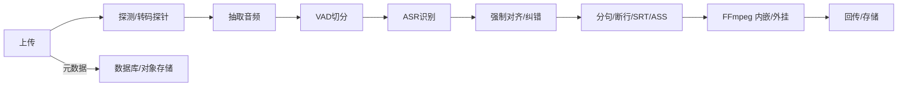

项目地址：[video_processing_service](https://github.com/GeekyWizKid/video_processing_service)

目标：把“上传 → 抽音频 → 识别 → 对齐 → 制作字幕 → 内嵌/外挂 → 回传”的全链路做得稳定、可恢复、可扩展。

<!--more-->

## 1. 端到端流程



设计原则：
- 可恢复：每一步产物落盘（对象存储）并带校验哈希；失败可从最近成功步重试；
- 幂等：产物按“内容哈希（CAS）”命名，重复上传不重复计算；
- 可观测：记录每步时延/失败率/峰值内存/显存占用；
- 可伸缩：ASR/VAD 独立 Worker，队列限流，支持 GPU/CPU 混部。

## 2. FFprobe/预处理

先做探针，统一采样率/声道，弱网情况下优先拷贝流：

```bash
ffprobe -hide_banner -v error -show_streams -select_streams a:0 input.mp4
ffmpeg -y -i input.mp4 -map a:0 -ac 1 -ar 16000 -c:a pcm_s16le audio.wav
```

对于码率过低/过高的视频，提前归一到目标分辨率与帧率，避免字幕烧录时失败。

## 3. VAD 切分（语音活动检测）

可选方案：
- WebRTC VAD：CPU 轻量，适合实时；
- Silero VAD：准确度更高，Python 端实现方便；
- pyannote/语音活动检测：重，但在嘈杂环境更稳。

切分策略：窗口 30ms，语音最短段 0.4s，段间合并阈值 0.2s，段与段重叠 0.15s，便于 Whisper 补字。

```python
def vad_split(wav: Path) -> list[Segment]:
    # 使用 webrtcvad + 能量门限双判定
    # 返回带重叠的片段及起止时间
    ...
```

## 4. ASR 识别（Whisper 家族）

- 模型：`faster-whisper`（CTranslate2），RTF 更低；
- 语言检测：先跑短前导段，确定语言与是否翻译；
- 长音频：分段并行识别，保留时间戳；
- 标点/数字/专名：可用小模型做后处理，或让 LLM 在语境中修复。

```python
from faster_whisper import WhisperModel

model = WhisperModel("medium", device="auto", compute_type="float16")

def transcribe(segment_wav: str):
    for s in model.transcribe(segment_wav, vad_filter=False, word_timestamps=True):
        yield s
```

## 5. 强制对齐与质量提升

识别后的时间戳并不总是准确。常见做法：
- WhisperX：用 CTC/phoneme 做对齐，提升词级时间戳准确率；
- aeneas：强制对齐文本与音频（TTS 对比），容错更强但慢；
- 合并相邻短句：控制单句时长 1–7s、阅读速度 15–20 CPS；
- 大写、专名、数字单位规范化。

## 6. 字幕生成与断行

SRT 适合通用播放器，ASS 更可控（字体/描边/阴影/位置）。

```srt
1
00:00:01,000 --> 00:00:03,200
这是第一句字幕

2
00:00:03,200 --> 00:00:05,100
第二句
```

ASS 样式模板：

```ini
[V4+ Styles]
Format: Name, Fontname, Fontsize, PrimaryColour, OutlineColour, BackColour, Bold, Italic, Underline, StrikeOut, ScaleX, ScaleY, Spacing, Angle, BorderStyle, Outline, Shadow, Alignment, MarginL, MarginR, MarginV, Encoding
Style: Default, Noto Sans CJK SC, 36, &H00FFFFFF, &H00000000, &H64000000, 0, 0, 0, 0, 100, 100, 0, 0, 1, 2.5, 0.8, 2, 30, 30, 36, 1
```

## 7. 内嵌与外挂

内嵌（烧录）：

```bash
ffmpeg -y -i input.mp4 -vf "subtitles=subtitle.ass:fontsdir=/path/to/fonts" -c:a copy out.mp4
```

外挂（保留软字幕流）：

```bash
ffmpeg -y -i input.mp4 -i subtitle.ass -c copy -c:s mov_text out.mp4
```

提示：
- Windows 路径转义；
- 需要自带字体时，可 `-attach` 字体到容器（MKV 支持更好）。

## 8. 编排与容错

作业系统：Redis/Rabbit + Worker。每步定义“输入/输出/副作用”，中间结果写对象存储。

```ts
// 任务定义（伪代码）
type Job = { id: string; videoUrl: string; status: 'queued'|'running'|'failed'|'done' }

queue.process('asr', { concurrency: 2 }, async (job: Job) => {
  const wav = await ensureWav(job.videoUrl)
  const segs = await vad(wav)
  const hyp = await asrParallel(segs)
  const aligned = await align(hyp)
  const subs = await renderSubtitles(aligned)
  return await burnOrMux(job.videoUrl, subs)
})
```

容错：
- 超时与重试（指数退避）
- 断点续跑（按产物存在与校验哈希跳过已完成步骤）
- GPU 资源限流（队列 + 显存监控）

## 9. 性能与成本

- ASR 是热点：对相同音频（MD5）做结果缓存；
- 吞吐：批量时优先 WAV PCM，避免重复解码；
- 端到端指标：RTF（实时因子）、TTFW（首词时间）、WER/CER；
- 成本：按分钟/每 1k token（若走云端 ASR）估算，做队列整形。

## 10. 上线注意

- 字体版权与合法性；
- 审核与敏感词（可在字幕落地后再过一遍）；
- 断点续传、多分片校验（大文件上传）；
- 国际化：右到左语言的字幕渲染、BIDI；
- 观测：每步时延、失败率、峰值内存/显存、队列积压长度。

总结：把流程拆成“可恢复”的小步骤，把最贵的 ASR 缓存起来，再通过编排与观测稳住长尾，就能让视频处理从脚本进化为服务。
